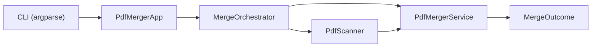

# PDF Merger

**CLI tool that merges PDF files from a folder into a single document with progress tracking and flexible output options.**


## Overview

PDF Merger is a command-line application that discovers PDF files in a specified folder (optionally recursively), sorts them alphabetically, and merges them into a single output file. It provides progress bars, color-coded console output, and robust error handling for corrupted or inaccessible files.

**Use case:** Combine course materials, scanned documents, or any collection of PDFs into one file without manual reordering.

**Status:** Production-ready. Supports pypdf (primary) and PyPDF2 (fallback). Partial merge on per-file errors with explicit user feedback.

## Tech Stack

| Layer      | Technology                    |
| ---------- | ----------------------------- |
| Language   | Python 3.8+                   |
| PDF Engine | pypdf ≥ 4.0 (PyPDF2 fallback) |
| CLI        | argparse, tqdm                |
| Formatting | black, isort                  |

## Architecture

```
main.py → cli.app → MergeOrchestrator → PdfScanner / PdfMergerService
```

The CLI parses arguments, builds `MergeSettings`, and delegates to `MergeOrchestrator`, which coordinates scanning, output path resolution, and merging. Core services (`PdfScanner`, `PdfMergerService`) are injected for testability and reuse.

### Execution Flow



## Project Structure

```
pdf-merger/
├── main.py              # Entry point; invokes cli.app.main()
├── cli/
│   ├── app.py           # PdfMergerApp — wiring, error handling, output
│   └── parser.py        # argparse setup (folder_path, --output, --recursive, --destination)
├── core/
│   ├── orchestrator.py  # MergeOrchestrator — folder validation, scan, merge flow
│   ├── scanner.py       # PdfScanner — discovers PDFs via glob
│   └── merger.py        # PdfMergerService — combines PDFs, returns MergeOutcome
├── config/
│   ├── settings.py      # MergeSettings dataclass
│   └── constants.py     # PDF_EXTENSION, MAX_PREVIEW_FILES, etc.
├── utils/
│   ├── console.py       # ConsoleMessenger — ANSI colors, formatted output
│   ├── colors.py        # ColorPalette
│   └── file_utils.py    # sanitize_filename, ensure_unique_output, limit_preview
├── pyproject.toml       # black, isort config
└── requirements.txt
```

## Getting Started

### Prerequisites

- **Python** ≥ 3.8
- **pip** (or uv / poetry)

### Installation

```bash
git clone https://github.com/ErikKopcha/pdf-merger.git
cd pdf-merger
pip install -r requirements.txt
```

### Running the App

```bash
# Basic: merge all PDFs in a folder
python3 main.py /path/to/folder

# Custom output name
python3 main.py /path/to/folder --output "My Merged Document"

# Recursive search in subfolders
python3 main.py /path/to/folder --recursive

# Custom destination folder
python3 main.py /path/to/folder --destination ~/Documents --output "Combined"
```

## Available Scripts

| Command                                | Description            |
| -------------------------------------- | ---------------------- |
| `python3 main.py <folder_path>`        | Merge PDFs from folder |
| `python3 main.py <folder_path> --help` | Show CLI help          |
| `black .`                              | Format code (black)    |
| `isort .`                              | Sort imports (isort)   |

## Key Features

- **Smart discovery:** Glob `*.pdf` or `**/*.pdf` (recursive)
- **Alphabetical order:** Files sorted by name before merge
- **Unique output:** Timestamp suffix when output file exists
- **Partial merge:** Skips failed files, reports them explicitly
- **Progress:** tqdm progress bar or fallback per-file messages
- **Validation:** Rejects non-directory source, file-as-destination

## Integration

Use as a library without running the CLI:

```python
from pathlib import Path

from config.settings import MergeSettings
from core.merger import PdfMergerService
from core.orchestrator import MergeOrchestrator
from core.scanner import PdfScanner
from utils.console import ConsoleMessenger

settings = MergeSettings(
    folder_path=Path("/path/to/pdfs"),
    recursive=True,
    output_name="merged",
    destination=None,
)
orchestrator = MergeOrchestrator(
    scanner=PdfScanner(),
    merger=PdfMergerService(progress_callback=None, error_callback=None),
    messenger=ConsoleMessenger(),
)
outcome = orchestrator.execute(settings)
```

## License

[MIT](LICENSE) © Erik Kopcha
